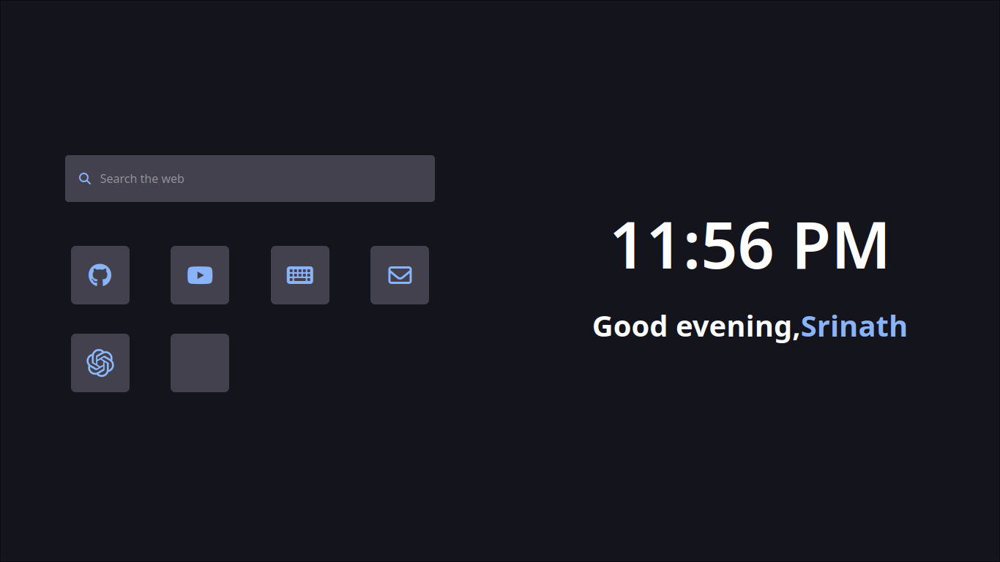

# FireDash 🦊 :

Welcome to FireDash, your personalized Firefox dashboard! FireDash is a simple yet powerful dashboard designed to enhance your browsing experience by providing quick access to your favorite websites while keeping you informed about the date and time. 🔥🦊

FireDash features a sleek and modern design in the delightful "catppuccino mocha" color scheme, making it both visually appealing and user-friendly. 😺☕️

## Showcase

## Features

- **Customizable Keys**: Customize your dashboard with keys that link to your favorite websites, allowing you to navigate the web with ease. 🗝️

- **Date and Time Display**: Stay organized and informed with the current date and time prominently displayed on your dashboard. 📅⏰

- **Sleek Design**: FireDash features a sleek and modern design in the delightful "catppuccino mocha" color scheme, making it both visually appealing and user-friendly. 🎨

## Getting Started

To get started with FireDash, follow these steps:

1. **Installation**: Just download the code and add that file location or just add custom userprofile.

2. **Customization**: After installation, customize your dashboard by adding your preferred websites to the customizable keys.

3. **Enjoy**: Start using FireDash to quickly access your favorite websites and stay updated on the date and time while browsing. 🚀

## Feedback and Support

Your feedback is valuable! If you have any questions, suggestions, or encounter any issues while using FireDash, please don't hesitate to reach out. 📧

## License

This project is licensed under the MIT License - see the [LICENSE](LICENSE) file for details. 📜
